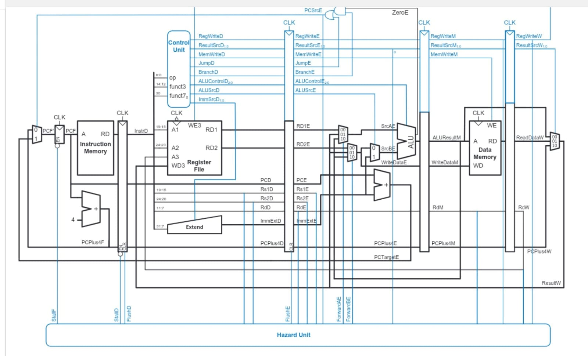
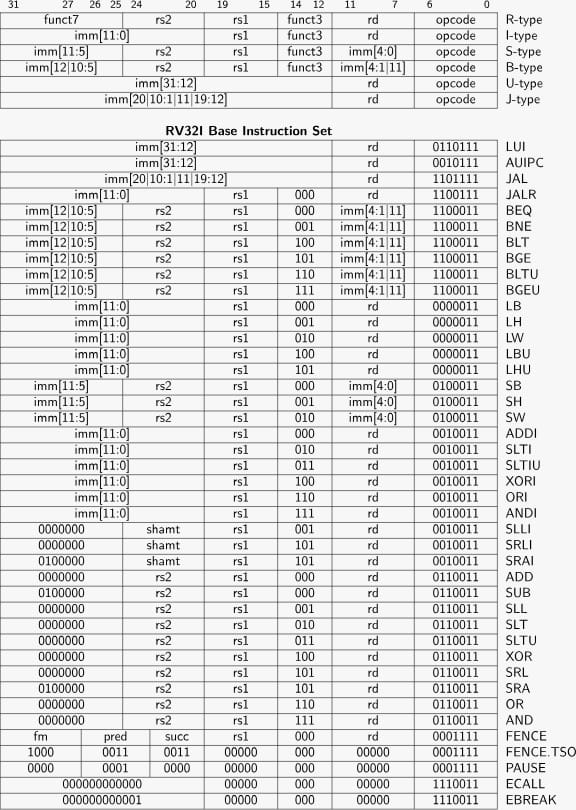

# 32-bit Pipelined RISC-V Processor

## Overview

A **32-bit RISC-V processor** designed and implemented in **Verilog HDL** using a **5-stage pipelined architecture**. The design supports instruction execution across **IF, ID, EX, MEM, and WB stages** and includes dedicated mechanisms to handle pipeline hazards and control-flow changes.

The processor was designed and functionally verified using **Xilinx Vivado**.

## Key Features

* **32-bit RISC-V pipelined processor**
* **5-stage pipeline:** IF → ID → EX → MEM → WB
* Modular RTL implementation in **Verilog HDL**
* Instruction fetch, decode, execute, memory access, and write-back
* Register file, ALU, Control Unit, Immediate Generator, Instruction Memory, and Data Memory
* **Data Hazard Detection Unit**
* **Load-use hazard handling through pipeline stalling**
* **Data Forwarding / Bypassing Unit** to reduce pipeline stalls
* **Branch Prediction mechanism** for improved control-flow handling
* Pipeline flushing/recovery on branch misprediction
* Functional verification using **Vivado Simulator**

## Major Enhancements

### ⚡ Data Forwarding

A forwarding unit detects data dependencies between pipeline stages and forwards the required result directly to the EX stage, reducing unnecessary stalls caused by **RAW (Read After Write) data hazards**.

### 🚧 Hazard Detection Unit

The hazard detection unit identifies dependencies, particularly **load-use hazards**, and inserts pipeline stalls when forwarding alone cannot resolve the dependency.

### 🔀 Branch Prediction

Branch prediction is incorporated to reduce control hazards and minimize pipeline performance loss caused by branch instructions. On an incorrect prediction, the pipeline is updated and incorrect instructions are flushed.

## Architecture

```text
Instruction Fetch
        │
        ▼
 ┌─────────────┐
 │ IF / ID Reg │
 └──────┬──────┘
        ▼
Instruction Decode
        │
        ▼
 ┌─────────────┐
 │ ID / EX Reg │◄──── Hazard Detection
 └──────┬──────┘
        ▼
     Execute ◄──────── Data Forwarding
        │
        ▼
 ┌─────────────┐
 │ EX / MEM Reg│
 └──────┬──────┘
        ▼
   Memory Access
        │
        ▼
 ┌─────────────┐
 │ MEM / WB Reg│
 └──────┬──────┘
        ▼
     Write Back
```

## Project Structure

```text
RISC-V-Processor/
├── rtl/                 # Verilog RTL modules
├── tb/                  # Testbench 
├── README.md
└── .gitignore
```

## Tools Used

* **HDL:** Verilog
* **EDA Tool:** Xilinx Vivado
* **Simulation:** Vivado Simulator
* **Version Control:** Git & GitHub

## Verification

The processor was functionally verified by simulating instruction execution and observing:

* Pipeline stage operation
* Register write-back
* Data forwarding paths
* Hazard detection and pipeline stalls
* Branch handling and pipeline flushing
* Branch prediction behavior

## Author

**Yaswanth Kumar**
M.Tech – Microelectronics and VLSI Design, IIT Madras
